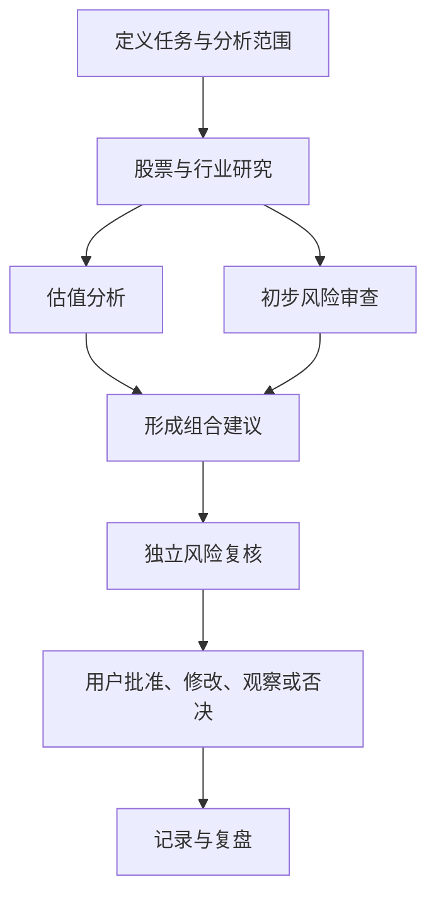

# Quantitative-Analysis-Basic-Skill
# 金融数据分析师

基于 Codex 自定义 Agent 的股票投资研究协作模板。

项目将股票研究拆分为公司与行业研究、估值、组合管理、风险合规和运营复盘五类专业职责，由主 Agent 负责协调，用户保留最终决策权。

> 本项目是一套 Codex 配置模板，不是独立应用，不提供行情数据，也不会自动执行交易。

## 核心特点

- **专业分工**：五个 Agent 各自负责明确的研究环节。
- **交叉复核**：估值、组合建议和风险意见相互独立。
- **证据优先**：优先使用公司公告、交易所披露和监管文件。
- **情景分析**：区分悲观、基准和乐观情景，避免虚假精确。
- **人工决策**：所有仓位、风险限额和真实交易均须由用户批准。
- **全程可追溯**：保留基准日期、数据来源、关键假设和意见分歧。

## Agent 分工

| Agent | 主要职责 | 不负责 |
| --- | --- | --- |
| `equity_researcher` | 公司与行业研究、财报及公告核验、竞争优势与风险分析 | 最终估值、仓位决策、交易执行 |
| `valuation_analyst` | 盈利预测、估值模型、情景与敏感性分析 | 买卖决策、仓位管理 |
| `portfolio_manager` | 综合研究与估值，提出仓位区间和建仓、减仓、退出条件 | 下单、资金操作 |
| `risk_compliance` | 独立检查数据质量、集中度、流动性、回撤和合规边界 | 为提高收益而放宽风险限制 |
| `operations_reviewer` | 成交记录检查、收益归因、日报月报和决策复盘 | 交易执行、财务或监管申报 |

## 协作流程



标准流程如下：

1. 明确标的、交易市场、基准日期、投资期限、币种和风险约束。
2. `equity_researcher` 建立带来源和日期的事实底稿。
3. `valuation_analyst` 与 `risk_compliance` 分别完成估值和初步风险审查。
4. `portfolio_manager` 综合研究结果，提出仓位区间与操作条件。
5. `risk_compliance` 对最终建议进行独立复核。
6. 用户决定批准、修改、继续观察或否决。
7. 用户提供真实决策或成交记录后，由 `operations_reviewer` 进行复盘。

简单任务不必调用全部 Agent。主 Agent 可根据任务选择必要的最少角色。

## 目录结构

```text
.
├── AGENTS.md
├── config.toml
└── agents/
    ├── equity-researcher.toml
    ├── operations-reviewer.toml
    ├── portfolio-manager.toml
    ├── risk-compliance.toml
    └── valuation-analyst.toml
```

- `AGENTS.md`：定义团队职责、协作流程、输出格式和安全边界。
- `config.toml`：配置权限、推理强度和 Agent 并发数量。
- `agents/*.toml`：定义各专业 Agent 的名称、职责和行为约束。

## 安装

### 前置条件

需要能够使用自定义 Agent 和子 Agent 工作流的 Codex 本地客户端。

相关官方文档：

- [Codex 自定义 Agent 与子 Agent](https://learn.chatgpt.com/docs/agent-configuration/subagents)
- [使用 AGENTS.md 配置项目指令](https://learn.chatgpt.com/docs/agent-configuration/agents-md)
- [Codex 配置参考](https://learn.chatgpt.com/docs/config-file/config-reference)

### 项目级安装

1. 下载或克隆本仓库。
2. 在需要使用该工作流的项目中创建 `.codex/` 目录。
3. 将 `config.toml` 复制到目标项目的 `.codex/config.toml`。
4. 将 `agents/` 复制到目标项目的 `.codex/agents/`。
5. 将 `AGENTS.md` 复制到目标项目根目录。
6. 从目标项目根目录启动新的 Codex 任务。

安装后的目标项目结构应类似：

```text
your-project/
├── AGENTS.md
└── .codex/
    ├── config.toml
    └── agents/
        ├── equity-researcher.toml
        ├── operations-reviewer.toml
        ├── portfolio-manager.toml
        ├── risk-compliance.toml
        └── valuation-analyst.toml
```

> 如果目标项目的目录名称与 `AGENTS.md` 中声明的适用范围不同，请先修改其中的适用范围。

## 使用示例

### 完整个股分析

```text
请使用金融数据分析团队分析贵州茅台（600519.SH）。

基准日期：2026-06-30
投资期限：3—5 年
币种：人民币
风险偏好：中等
要求：
1. 核验公司公告、财报和交易所披露；
2. 给出悲观、基准和乐观三种估值情景；
3. 提出仓位区间以及建仓、减仓和退出条件；
4. 由风险合规 Agent 独立复核；
5. 明确列出数据缺口、意见分歧和需要我批准的事项。
```

### 仅进行公司研究

```text
请调用 equity_researcher，研究目标公司的商业模式、竞争优势、
增长驱动、治理情况和主要风险。区分已核实事实、管理层观点和自主推断，
暂不进行估值或仓位分析。
```

### 独立审查已有观点

```text
请调用 risk_compliance，对以下投资观点进行独立审查。

重点检查：
- 数据是否过时或缺少来源；
- 是否存在确认偏误或逻辑跳跃；
- 集中度、流动性和最大回撤风险；
- 哪些条件下该观点将失效。

请给出“通过”“附条件通过”或“不通过”的结论。
```

### 交易复盘

```text
请调用 operations_reviewer，根据我提供的真实成交记录进行复盘。
请区分真实成交、历史建议、目标价格和模拟结果，并检查是否能够完成对账。
```

## 推荐输入信息

为了提高分析质量，建议每次任务至少提供：

- 公司名称、证券代码和交易市场；
- 分析基准日期；
- 投资期限和使用币种；
- 风险承受能力及最大仓位限制；
- 已有持仓和现金需求；
- 允许使用的数据来源；
- 期望的输出格式。

如果关键数据不足，Agent 应暂停形成确定性结论，并列出需要补充的资料。

## 数据与分析原则

- 优先使用交易所、监管机构和公司正式披露等一手资料。
- 所有关键数字应保留来源、日期、币种、单位以及历史或预测属性。
- 股票价格、财务数据和公司事件必须按分析基准日期核验。
- 发生事实冲突时保留不同口径，不得直接隐藏分歧。
- 发生估值冲突时比较假设和计算方法，不得简单取平均值。
- 无法核实的数据应明确标记为不确定，不得编造或补齐。

## 安全边界

本项目中的 Agent 不得自主执行：

- 真实证券买卖、撤单或衍生品交易；
- 资金划转、账户授权或券商联系；
- 最终仓位、止损规则和风险限额决策；
- 向投资者、合作方或监管机构发送报告；
- 财务记账、税务申报或监管报送；
- 对投资收益作出承诺或保证。

## 免责声明

本项目仅用于研究流程辅助和技术交流，不构成投资建议、收益保证、法律意见、税务意见、审计意见或自动交易指令。

金融市场存在风险。任何投资判断和交易决定均应由用户独立作出，并在必要时咨询持牌投资顾问、律师、会计师或其他专业人士。
